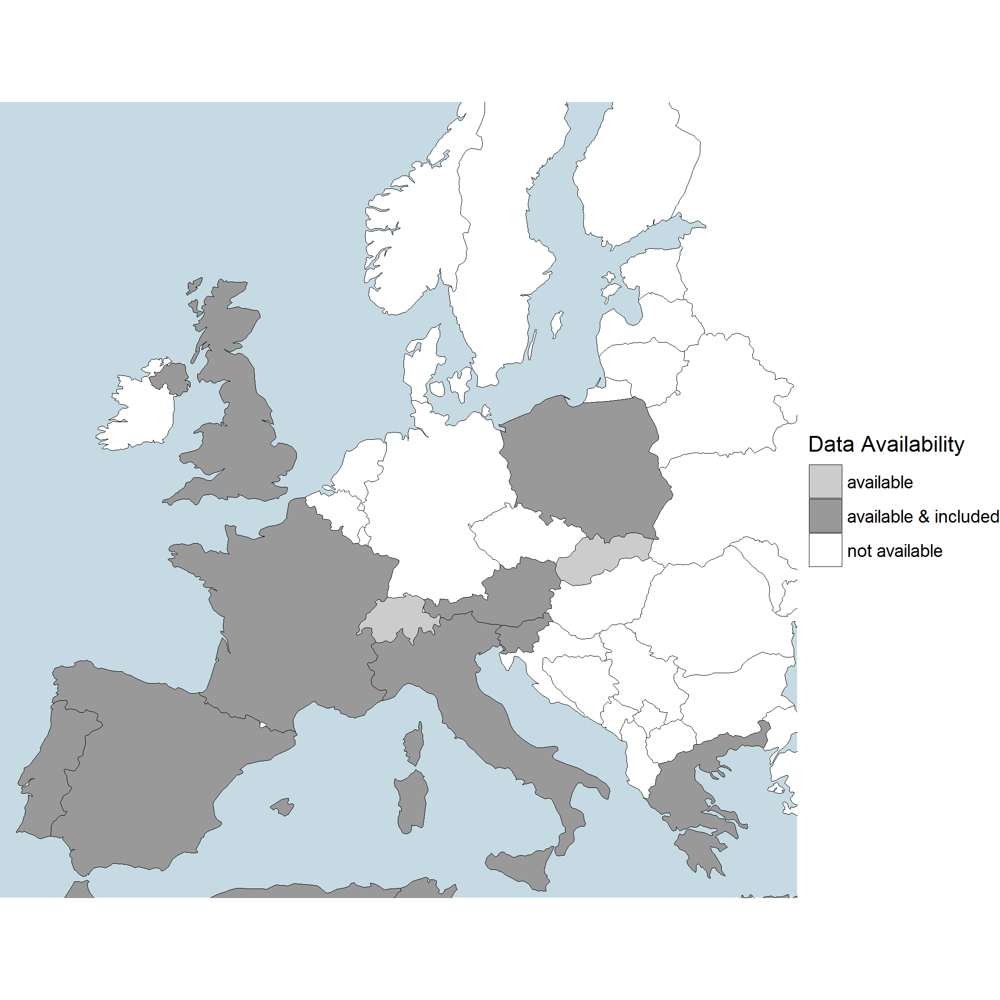

SMIRES is a COST Action addressing the Science and Management of Intermittent Rivers & Ephemeral Streams. SMIRES brings together more than 200 hydrologists, biogeochemists, ecologists, modelers, environmental economists, social researchers and stakeholders from 31 different countries to develop a research network for synthesising the fragmented, recent knowledge on IRES, improving our understanding of IRES and translating this into a science-based, sustainable management of river networks. More information about SMIRES can be found at <http://www.smires.eu/>. 

This git repository hosts the R-package `smires`, one of several outcomes of Working Group 1 (WG1, Prevalence, distribution and trends of IRES). Given time series of daily (weekly, monthly) discharges, its purpose is:


* to identify gauging stations that have an IRES flow regime;
* to calculate relevant flow and intermittency metrics.

# Installation of the R-package

In order to use the development version of the package `smires`  you will need to install the package `devtools` once. 

``` r
install.packages("devtools")
```


It provides the convenient command `install_github()` which installs the most recent version of a package hosted on github. To do so, simply execute the following three lines:
``` r
library(devtools)
install_github("mundl/smires")
library(smires)
```

The current version is ``r packageVersion("smires")``. To load this package in an R session, `library(smires)` has to be called. 
``` r
library(smires)
packageVersion("smires")
```

# Vignettes

The usage of the package is demonstrated in these four preliminary vignettes. They are currently under development.
 
 * The [concept](https://homepage.boku.ac.at/h0540352/smires/concept.html) of the R package **smires**.
 * How to compute smires [metrics](https://homepage.boku.ac.at/h0540352/smires/metrics.html).
 * To compute the metrics mentioned above, we make use of the following [framework](https://homepage.boku.ac.at/h0540352/smires/framework.html).
 * This [vignette](https://homepage.boku.ac.at/h0540352/import/metrics.html) explains in detail how data and meta data is imported. 


# Examples

Each participating country was asked to suggest metrics and to submit a few time series with intermittent streamflow. As we plan to integrate the provided time series in the R package, we need permission of the copyright holder to make the data available. The column **include** of the following table indicates if the data can be published. 


### Time Series 

```{r results = 'asis', echo = FALSE} 

contrib_ts <- function(country, contact, ts = NA, publish = NA, comment = NA, meta = FALSE)
{
  data.frame("country" = country, "contact" = contact, "time series" = ts,
             "include" = if(is.na(ts)) NA else publish,
             "comment" = comment,
             check.names = FALSE, stringsAsFactors = FALSE)
}

series <- list(
  contrib_ts(country = "ch",
             contact = "ilja.vanmeerveld@geo.uzh.ch",
             ts = "Altlandenberg"),
  
  contrib_ts(country = "lt",
             contact = "hydro@mail.lei.lt"),
  
  contrib_ts(country = "it",
             contact = "giuseppe.verdiani@adb.puglia.it",
             ts = "Carapelle Torrent",
             comment = "Region Puglia",
             publish = TRUE),
  
  contrib_ts(country = "uk",
             contact = "catsef@ceh.ac.uk",
             ts = "Balder at [Balderhead Reservoir](http://nrfa.ceh.ac.uk/data/station/info/25022), Ampney Brook at [Ampney St Peter](http://nrfa.ceh.ac.uk/data/station/info/39099)",
             publish = TRUE,
             comment = "Balder: human influence, Ampney Brook: chalk stream that dries naturally"), 
  
  contrib_ts(country = "pl",
             contact = "kazimierz_banasik@sggw.pl",
             ts = "Plachty Stare",
             comment = "uses hydrological year, starting with November", 
             publish = TRUE),  
  
  contrib_ts(country = "pl",
             contact = "rmrutkow@cyf-kr.edu.pl",
             ts = "Goryczkowa",
             comment = "only 3 years of observation",
             publish = TRUE),
  
  contrib_ts(country = "fr", 
             contact = "ytramblay@gmail.com",
             ts = "37 stations",
             publish = TRUE),  
  
  contrib_ts(country = "fr", 
             contact = "eric.sauquet@irstea.fr",
             ts = "H1333010, H1503910, H1513210, H1603010, H1713010, H1932020",
             publish = TRUE),

  contrib_ts(country = "es", 
             contact = "luis.mediero@upm.es",
             ts = "8060, 9052",
             publish = TRUE),
  
  contrib_ts(country = "es", 
             contact = "francesc.gallart@idaea.csic.es",
             ts = "Riu Manol"),
  
  contrib_ts(country = "it", 
             contact = "annamaria.degirolamo@ba.irsa.cnr.it",
             ts = "Celone, Salsola", 
             comment = "[source](http://www.protezionecivile.puglia.it/centro-funzionale/analisielaborazione-dati/annali-idrologici-parte-ii)",
             publish = TRUE,
             meta = TRUE),
  
  contrib_ts(country = "pt", 
             contact = "teresal@ipcb.pt",
             ts = "Coruche, Monforte, Pavia, Moinho"),  
  
  contrib_ts(country = "pt", 
             contact = "helena.alves@apambiente.pt",
             ts = "Moinho da Gamitinha, Torrão do Alentejo",
             comment = "[source](http://snirh.pt/)", 
             publish = TRUE, 
             meta = TRUE),

  contrib_ts(country = "gr", 
             contact = "rania.tzoraki@aegean.gr",
             ts = "Vrontamas",
             publish = TRUE),

  contrib_ts(country = "sk", 
             contact = "kohnova@stuba.sk",
             ts = "Čierna voda, Bodva, Chlmec, +4 stations",
             publish = FALSE),

  contrib_ts(country = "cy", 
             contact = "gdorflinger@wdd.moa.gov.cy",
             ts = "Peristerona, Pouzis, Liopetri",
             publish = TRUE),
  
  contrib_ts(country = "at", 
             contact = "t.gauster@boku.ac.at",
             ts = "...",
             publish = TRUE),
  
  contrib_ts(country = "si", 
             contact = "simon.rusjan@fgg.uni-lj.si",
             ts = "13 station of which 7 are intermittent",
             publish = NA))

series <- do.call(rbind, series)
series <- series[order(!series$include, series$country), ]
series$contact <- sub(".@", "*@", series$contact)
row.names(series) <- NULL

dat <- subset(series, !is.na(series$`time series`), select = c("country", "include"))
```

Currently ``r length(unique(dat$country))`` countries have submitted time series of which  ``r length(unique(dat$country[dat$include]))`` countries agreed on including the data into the R-package.

```{r, coverage, echo = FALSE, message=FALSE}
poly <- readRDS(file = "dev/coastlines.rds")
levels(poly$country)[levels(poly$country) == "gb"] <- "uk"

poly$col <- "not available"
poly$col[poly$country %in% dat$country] <- "available"
poly$col[poly$country %in% dat$country[dat$include]] <- "available & included"

library(ggplot2)
p <- ggplot(poly, aes(long, lat, group = id, fill = col)) + 
  geom_polygon(col = 1, size = 0.2) +
  scale_fill_manual("Data Availability", values = c("not available" = "white", "available" = "grey80", "available & included" = "grey60")) + 
  coord_fixed(xlim = c(2923408-500000, 5309418), ylim = c(1576769-300000, 4855870 - 700000)) + 
  theme_void() +
  theme(panel.background = element_rect(fill = "#C5DAE3"))
ggsave(plot = p, file = "inst/contributors.png")
```



```{r results = 'asis', echo = FALSE} 
options(knitr.kable.NA = '')
knitr::kable(series, caption = "Participants", format = "markdown")
```

<!--### Metrics -->


```{r results = 'asis', echo = FALSE} 

contrib_metric <- function(name, type = "NA", description = NA, comment = NA, 
                           dt = c("daily", "weekly", "monthly"), country)
{
  dt <- match.arg(dt)
  list("metric" = name, type = type, "description" = description,
       "\U0394t" = dt, "comment" = comment, country = sort(country))
}

metrics <- list(
  contrib_metric(name = "Number of days with zero flow",
                 description = "Total number of days with zero flow", 
                 type = "duration",
                 country = c("ch", "at", "gb")),
  contrib_metric(name = "Recession constant",
                 description = "Recession constant during the period with the lowest flow or slope of the flow duration curve", 
                 type = "magnitude",
                 country = c("ch", "es"))
)

countries <- unique(unlist(lapply(metrics, function(x) x$country), 
                           use.names = FALSE))
# matrix of country using a metric
cm <- used <- t(sapply(metrics, function(x) countries %in% x$country))
cm[used] <- "\U2714"
cm[!used] <- ""
colnames(cm) <- countries

metrics <- do.call(rbind, lapply(metrics, function(x) 
  as.data.frame(x[setdiff(names(x), "country")], as.is = TRUE) ))
metrics <- data.frame(metrics, cm)
metrics <- metrics[order(metrics$type), ]
row.names(metrics) <- NULL

#knitr::kable(metrics, caption = "Participants")
```


# Getting in Contact
In case you are interested or you want to contribute to the package `smires` (even though you are not part of the [SMIRES cost action](http://www.smires.eu/)) please contact <t.gauster@boku.ac.at>. 
