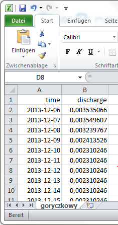

generated with `r R.version.string` and **smires** version `r packageVersion("smires")`

# Importing from text files

```{r setup, include=FALSE}
knitr::opts_chunk$set(echo = TRUE)
```

Let us start by loading the package **smires**:
```{r, message=FALSE}
library(smires)
```


Suppose we have a discharge time series of the Goryczkowy Stream in Poland stored in a spreadsheet, for example named `goryczkowy.xlsx`. It has two columns, the first column containing the date of the observation and the second column containing the discharges in m^3^/s. 



It is best to save the spreadsheet in text format, either as txt or csv (comma separated values). Depending on your language settings, the resulting file (`goryczkowy.csv`) might look like the following. Here the semicolon `';'` is used as a field separator and the comma `','` is the decimal separator. To simplify the import, it's recommended to keep the date in 'year-month-day' format as shown above.

Let us have a look at the first 10 lines of the text file `goryczkowy.csv`. We can see that the first row is used for column names, followed by the actual discharge observations. 

```{r, comment=""}
filename <- "../../ts/pl/goryczkowy.csv"
filecontent(filename)
```

This file can easily be imported into R with the `read.smires()` command. It supports all arguments known from the base R import functions like `read.table()` or `read.csv()` Based on the previous choice of field separator and decimal separator, we need to set `sep = ";"` and `dec = ","`. The default argument `format = '%Y-%m-%d'` is correct for this time series therefore it is not necessary to specify it. 

```{r}
infile <- read.smires(file = filename, sep = ";", dec = ",")
infile
```

The result is an object of class `tibble` which is very similar to a `data.frame` but behaves more conveniently in certain circumstances. An introduction to tibbles can be found in this [vignette](https://cran.r-project.org/web/packages/tibble/vignettes/tibble.html).  

The package **smires** aims to provide simple support of station meta data. Available meta data is stored as an attribute, accessible either via `attr(infile, "smires")` or `attr_smires(infile)`. If no additional meta data was provided, the attribute has just three elements: 

* `dt`: the time step $\Delta t$ of the time series
* `filename`: the file name of the imported file 
* `dirname`: the directory of the imported file 


```{r}
attr_smires(infile)
```


# Importing meta data

This section demonstrates how additional meta data like station coordinates, catchment size, etc. can be imported. There are three ways of importing metadata alongside the discharge data:

1. The meta data is stored as a comment in the file **header** of the discharge time series. This is recommended only if you have to handle a very small number of stations, e.g. less than three. 
2. The meta data of *several stations* is passed on to the `metadata` argument of the importing function as a **data frame**. This is probably the most convenient solution when importing large numbers of stations. 
3. Meta data can also be passed on to the `metadata` argument as a **named list**, e.g. `smires(..., metadata = list(country = "uk", river = "Thames"))`. You will have to adapt the code for each time series that is going to be imported. This is error-prone and therefore not recommended. 


## Meta data is stored in the header
Let's take the following example from Italy. At the beginning of the file I have inserted a few lines starting with a hash (`#`) and followed by key-value pairs. The first 10 lines look like this:
```{r, comment=""}
filename <- "../../ts/it/celone.csv"
filecontent(filename)
```

The hash is the default comment character of `read.smires()`. Diverging comment characters can be specified by e.g. `comment.char = "'"`. Everything between the comment character and the first field separator (excluding surrounding white-space) is interpreted as the key and is subsequently used as name in the list of attributes. 
The first line in this file means that national identifier (`id`) for this station is the character string `"celone"`. The key is called `id` and its value is `"celone"`. You are free to add as many key-value pairs as you like. If two values are assigned to the same key, the latter one wins. 

```{r}
infile <- read.smires(file = filename, sep = ";", dec = ",", na.strings = "NAV")
infile
```

The result of `read.smires()` has the same structure as in the example above, except that now the additional attributes are retained. 


```{r}
attr_smires(infile)
```


## Meta data is supplied as a data frame
When importing several files at once or if the meta data is in separate table (called `meta`), we can provide this table to the `metadata` argument of `read.smires(..., metadata = meta)`. The function `read.metadata()` imports the table of meta data and ensures that there is a properly formatted column called `filename` containing the file names of the corresponding discharge time series. Rows containing invalid file names (empty strings) are dropped. This for example, is the complete table of station meta data for Portugal:
```{r}
metaFile <-  "../../ts/pt/runoff/meta-teresa.csv"
meta <- read.metadata(file = metaFile, sep = "\t", dec = ".")
meta
```


This example from Portugal has a more complicated file format. It contains 4 leading header lines and a total of 8 columns which are separated by tabs.

* row 1: time stamp 
* rows 2, 3: annual discharge + data quality flag (no data)
* rows 4, 5: daily discharge + data quality flag (data starting in Oct 1961)
* rows 6, 7: monthly discharge + data quality flag (data starting in Oct 1955)
* and a totally empty last column. 

```{r, echo=FALSE, comment=""}
filename <- "../../ts/pt/runoff/serie_monforte.txt"
filecontent(filename, encoding = "cp1252")
filecontent(filename, skip = 73, encoding = "cp1252")
```

Let us construct the call to `read.smires()` step by step:

* `file = dischargeFile`:  The name of the file to import.
* `skip = 4`: There are 3 header lines and one line for the column names. As we are going to choose shorter names we can skip the first four lines. 
* `sep = "\t"`: Tabs are used as field delimiters.
* `colClasses = ...`: We can use the `colClasses` argument to control which columns we want to keep. Use `"NULL"` for columns which get skipped, `"character"` for the time stamp and `"numeric"` for the discharge column.
* `col.names = ...`: A vector of column names used. Has to be as long as `colClasses`. Make sure to call the column containing the time stamp `time`.
* `format = "%d/%m/%Y"`: The format specifier for the time column, see `?strptime()`.
* `metadata = meta`: If the argument `metadata` is of class list, the line matching the `file` argument is appended to the attributes. 


```{r}
dischargeFile <- "../../ts/pt/runoff/serie_monforte.txt"
infile <- read.smires(
  file = dischargeFile, 
  skip = 4, sep = "\t", 
  colClasses = c("character", rep("NULL", 2), "numeric", rep("NULL", 4)),
  col.names = c("time", "yearly", "flag.y", "discharge", "flag.d", 
                "monthly", "flag.m", "empty"),
  format = "%d/%m/%Y", 
  metadata = meta)

attr_smires(infile)
```

## Meta data is supplied as a list

One can also pass a named list to the `metadata` argument of `read.smires()`. Explicitly specified meta data via the `metadata` argument always has precedence over meta data in the file header. Taking the Italian example from before and providing the meta data as a list ignores the meta data header written in the file header of `celone.csv`.  

```{r}
filename <- "../../ts/it/celone.csv"
infile <- read.smires(file = filename, 
                      sep = ";", dec = ",", na.strings = "NAV", 
                      metadata = list(id = "an arbitrary ID",
                                      region = "somewhere in Europe"))
```


```{r}
attr_smires(infile)
```

# Importing several files

`read.smires()` is vectorized over the `file` argument, enabling you to import several files with the same import arguments at once. 

```{r}
files <- c("../../ts/it/celone.csv", "../../ts/it/salsola.csv")
allfiles <- read.smires(file = files, sep = ";", dec = ",", na.strings = "NAV")

allfiles
attr_smires(allfiles)
```


# Validating a time series 

The function `validate()` performs a few checks regarding the suitability of the data for SMIRES analysis, including:
  
  * Length of record. We advise a minimum length of 10 years to compute reliable SMIRES metrics. 
  * Invalid time indices. There must be no `NA` values in the time index.
  * It removes complete duplicates, rows where `time` and `discharge` are duplicated.
  * It sorts the time series on the time index. 
  * It checks if the time series is regular. If not, a warning is risen and `NA` values are inserted to obtain an evenly spaced time series.
  * It checks for measurements which are equal or below a given detection limit/accuracy. These are reported. 
  * It checks for discharge values which are equal to zero. It is unlikely/impossible that one can actually observe a flow of 0 l/s. 
  * It checks for discharge values which are negative. These values are replaced with `NA` values.
  * The total number and the fraction of `NA` values is reported. 
  * Optionally, the user can choose to fill short gaps using linear interpolation. The argument `approx.missing = 3` for example allows to fill gaps up to a length of 3 days. 
  
The validated (and possibly modified) time series is returned.   
  

```{r, }
ts <- validate(allfiles[[2]])
```
